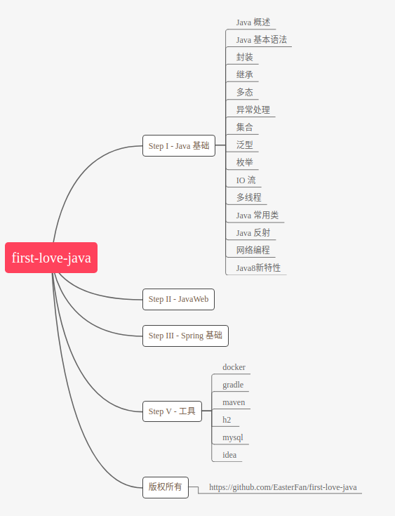

# 写在前面

这是一个学了三年 Java 依然不得门路的小白维护的笔记型开源项目，截止到2019年4月22日，站在庞大的 Java 体系面前，作者仍有一种门外汉的愧疚感  

和很多人一样，作者从大一下开始接触编程，Java 是作者的第一个编程语言，一年之后，作者遇到了初恋，在java有几种数据类型都说不上来的情况下，作者吹牛逼说自己已经对 Java 三大框架了如指掌，各种redis，nosql信手拈来  

好在初恋是物理专业，作者滔滔不绝说着自己都不懂的鬼话，初恋听得半懂不懂但觉得作者是如此牛逼之人向作者投来了崇拜的目光。

莫名其妙的开始，意料之中的结束。甚至不知道这是上天注定的，还是人刻意为之，或者两者都有。    

作者几度放弃 Java 的学习，又几度不甘心放弃重新拿起。  

于是有了这个笔记项目，作者取名为 **"初恋 Java"**，意为 Java 体系复杂庞大，第一遍学习痛苦不堪，边学边忘不得要领，第二遍第三遍复盘回味时会有新的感受。  

内容较浅显，主要是自己的理解和一些主流课程中讲师的原句，比较适合刚入门的小白，或者反复学习反复放弃未形成知识体系的家伙。  

# 学习路径
  

[https://processon.com/view/5cbe7431e4b085d010810ef0#map - 持续更新中](https://processon.com/view/5cbe7431e4b085d010810ef0#map)  

# 学习资料
Java 基础：  
马士兵java入门（100多节课的那个）- 条理很清晰  
慕课网Java 入门 - 偏基础，深度不够，但适合0基础  

JavaWeb：  
《JavaWeb 王者归来》  

Spring  
慕课网上的免费入门课程，还在学习中。。。  

# TODO
- [ ] maven 迁移  
- [ ] docker 迁移  
- [ ] idea 骚操作  
- [ ] Java 基础笔记迁移  
- [x] 2019-04-22   完成大概框架  
- [x] 某年某月      突然产生的想法
