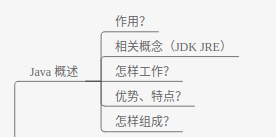

# Java 可以做什么
  

# 了解 Java
## 两个概念
### 1. JDK(java开发工具包)

JDK中有两大组件:  
- javac 编译器 -- .java 转为 .class
- java  解释器 -- 运行 .class 文件

### 2. JRE(java 运行环境)  

- 包括 JVM , java 核心类库和支持文件.  
- 如果要运行编译后的 java 文件,需要安装 jre；如果要开发 java 程序,需要安装jdk     
- jdk 中附带有 jre

  

### 3. JVM
JVM 是一个虚拟的计算机，具有指令集并使用不同的存储区域。负责执行指令，管理数据、内存、寄存器。  
对于不同的平台，有不同的虚拟机。  
Java 虚拟机机制屏蔽了底层运行平台的差别，实现了“一次编译，到处运行”。  

## Java 是怎样工作的
  

java 编译器将 .java文件编译成 .class 字节码文件, JVM 将字节码解释执行 ,转换成具体平台上的机器指令, 实现一次编译,到处运行.  

## Java 的优势（特点）  
- 跨平台（JVM 屏蔽底层差异，一次编写，处处运行）  

# Java 组成成分  
变量和常量是java语言的最小单位（对大部分语言来说都是这样）   

