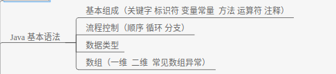

# 基本组成（关键字 标识符 变量常量 方法 运算符 注释）
## 关键字
关键字的定义：被 Java 语言赋予了特殊含义，用做专门用途的字符串（单词）  
关键字的特点：关键字中所有字母都为小写  

- 用于定义数据类型的关键字：class 、interface、enum、byte、short、int、long、float、double、char、boolean、void  
- 用于定义数据类型值的关键字：true、false、null  
- 用于定义流程控制的关键字：if、else、switch、case、default、while、do、for、break、continue、return  
- 用于定义访问权限修饰符的关键字：private、protected、public
- 用于定义类，函数，变量修饰符的关键字：abstract、final、static、synchronized  
- 用于定义类与类之间关系的关键字：extends、implements  
- 用于定义建立实例及引用实例，判断实例的关键字：new、this、super、instanceof  
- 用于异常处理的关键字：try、catch、finally、throw  
- 用于包的关键字：package、import  
其他修饰符关键字：native、strictfp、transient、volatile  

> Java 保留字：现有 Java 版本尚未使用，但以后版本可能会作为关键字使用。自己命名标识符时要避免使用这些保留字：byValue、cast、future、generic、inner、operator、outer、rest、var、goto、const

## 标识符
Java 对各种**变量、方法和类**等要素命名时使用的字符系列成为标识符。标识符命名尽量见文知意。  

定义合法标识符规则：  
1. 由 26 个英文字母大小写，0-9，_ 或 $ 组成
2. 数字不可以开头
3. 不可以使用关键字和保留字，但能包含关键字和保留字
4. Java 中严格区分大小写（强类型语言的特点），长度无限制
5. 标识符不能包含空格

Java 中的名称命名规范：（尽量遵守）
- 包名：多单词组成时所有字母都小写：xxxyyyzzz
- 类名、接口名：多单词组成时，所有单词的首字母大写：XxxYyyZzz
- 变量名、方法名：多单词组成时，第一个单词首字母小写，第二个单词开始每个单词首字母大写：xxxYyyZzz
- 常量名：所有字母都大写。多单词时每个单词用下划线连接：XXX_YYY_ZZZ

## 变量常量
> 变量存在**栈**里,常量存在**常量池**里,new出来的存在**堆**里.  

### 变量常量的分类  
> 按照变量的作用范围,按照常量的类型分类：  

#### 变量的分类:  
类级,对象实例级,方法级(局部变量),块级  

|分类    |成员变量                           |局部变量                          |类变量              |
|------|-------------------------------|------------------------------|-----------------|------|------------------------|-----------|
|作用范围  |定义在类中,在整个类中都可以被访问                   |只定义在局部范围内. 如:函数内/语句内等。|类变量是加了static 的成员变量;定义在类中; 在整个类中都可以被访问|
|存储位置|成员变量随着对象的建立而建立；存在于对象所在的堆内存中。|局部变量存在于栈内存中。作用的范围结束；变量空间会自动释放。|随类的加载而建立;存在与方法区中;随类的回收而消失,生命周期最长|
|默认初始化值|有                              |无                             | 不确定               |


#### 常量的分类:  
1. 整数常量。所有整数
2. 小数常量。所有小数
3. 布尔型常量。较为特有,只有两个数值。true false。
4. 字符常量。将一个数字字母或者符号用单引号( ' ' )标识。
5. 字符串常量。将一个或者多个字符用双引号标识。
6. null常量。只有一个数值就是:null.
7. 被final修饰的变量


### 变量的存储  
java 将内存分为三个部分:**堆,栈,常量池,方法区,本地方法区,寄存器**  


> 变量如果没有被初始化,就不能被使用

```java
int x;
System.out.print(x);   // 报错; x没有被初始化赋值,不能被使用
```

## 方法（重载  重写 静态）
> 方法重写

```bash
1. 在有继承关系的两个类中，子类重写父类的方法
2. 方法名，方法返回值，参数列表（顺序/个数/类型）与父类完全一致
3. 子类方法访问修饰符范围 >= 父类访问修饰符范围
```

> 方法重载

```bash
1. 同一个类中
2. 方法名相同，参数列表不同（顺序/个数/类型）
3. 方法返回值，访问修饰符随意
```


## 运算符
> 运算符是一种特殊的符号，用以表示数据的运算、赋值和比较等。  

### 算术运算符
```bash
+  -  + - * / % ++ -- +
```
注意：  
```bash
1. 前++：先+1，后运算     后++：先运算，后+1
2. +：String字符串与其他数据类型只能做连接运算，且结果为String类型。
3. 除法运算,如果两个数都是整数,最后结果就是整数； 如果两个数中有一个数是小数,最后结果保留小数.
```

### 赋值运算符
```bash
=   +=  -=  *=  /=   %=
```

注意：  
```java
short s = 10;
s = s + 5;//编译异常
s = (short)(s + 5);
s += 5;//不报错，结果不会改变s的数据类型。
```

### 比较运算符（关系运算符）
> 进行比较运算操作以后，返回一个 boolean 类型的值，关系运算符主要用于条件和循环语句中的判断条件

```bash
==  >   <  >=   <= instanceof
```

```java
       // 两个字符相比,比较的是两个字符的ASCII值
       char a = 'A';
       char b = 'B';
       System.out.println(a > b);     // false

       // 浮点数与整数相比,只要值相等,返回的就是true
       float f = 5.0f;
       long l = 5;
       System.out.println(f==l);     // true
```

### 逻辑运算符

```bash
& &&  |  ||  ^ !
```

> && 和 || 都是短路运算符, 只要前一个条件满足，就不进行下一个条件的判断

### 位运算符
> 位运算是直接对二进制进行运算(位运算符两端是数值类型的数据). 位运算是效率最高的运算


## 注释
> 单行注释和多行注释被忽略, 文档注释解析成 javadoc

```java
// 单行注释
/*多行注释*/
/**
文档注释 - 可被解析成 javadoc
*/
```

# 流程控制（顺序 循环 分支）
## 分支控制
> 多重if / 嵌套if / switch

if 和 switch 区别：  
if 判断条件是boolean类型，且判断条件是一个范围，switch 判断条件是常量值，if相对灵活。  

switch语句选择的类型只有四种:byte, short, int , char, String。
```java
switch (score){
  case 1 :
  abc;break;
  case 2 :
  dfg;break;
}
```

## 循环控制
> while do-while for循环 循环嵌套

### while

```java
 int n = 1;   // 1. 循环变量n必须先初始化
 while (n < 5){   // 3. 表达式为true时, 语句才会被执行
            System.out.println(n);   // 语句
            n++;  // 2. 循环变量n必须改变
        }
```

### do..while
> 不管表达式是否符合条件,循环都会被执行一次

```java
int n = 1;
do {
  System.out.println(n);
  n++;  
} while (n == 5);
```

### for循环

  

> for循环的组成 for(初始化表达式;循环条件表达式;循环后的操作表达式) { 执行语句; }

for循环的变形：  
```java
// 修改循环后的操作表达式
        int x = 0;
        for(System.out.println("a");x<3; System.out.println("c") ){
            System.out.println("b");
            x++;
        }

// 将int i拿到外面,可以扩大循环变量的作用范围.
      int i=1;
      for(;i<=10;i++){
          System.out.print(i);
      }
// 将判断条件放到里面.
        int i=1;
        for(;;i++){
            System.out.print(i);
            if (i==10)break;
        }
// 将i++ 放到里面.
        int i=1;
        for(;;){
            System.out.print(i);
            if (i==10)break;
            i++;
        }

// 这种情况下,可以极致的转为while
       int i=1;
       // for(;;)
        while(true){
            System.out.print(i);
            if (i==10)break;
            i++;
        }

// for 和 while 的无限循环
        for(;;;){}
        while(true){}
```

### break 和 continue

- break语句后的代码不会被执行(有 if 逻辑也不行)，continue后的代码会被执行(有 if 逻辑即可)
- break在多重循环中,只向外跳出一层,结束当前所有循环，continue结束当前循环,执行下一次循环

```java
// 多重循环中,通过给循环标号, 使 break/continue 跳出指定循环.
  out:for(int x=1;x<7;x++){
           in: for(int y=1;y<x;y++){
                System.out.println(y);
                if(y==4) break out;
            }
        }
```

# 数据类型
## 六大数据类型的分类

(整数默认:int 小数默认: double)

## 自动类型转换
  
实线为无数数据损失的转换,虚线为可能发生数据丢失的自动转换.  

## 强制类型转换
若A类型的数据表示范围比B类型大,则将A类型的值赋给B类型,需要强制类型转换.  

```java
// 整型转字符  自动与强转
char c1 = 65;
char c2 = (char)65536;


// long 转 float 自动转损失数据
float f1  = 102984762874647657283477L;
System.out.println(f1);    // 1.029847628e20

```

# 数组（数组初始化  选择排序 冒泡排序 二分查找 数组传参）
> 数组：相同数据类型的数据的组合。

## 数组初始化：  
```java
// 静态初始化（声明与赋值同时进行）
int[] score1 = new int[]{72, 90, 58};
int[] score1 = {72， 90， 58};

int[][ ] scores;
scores = new int[][]{ {1, 2, 3},{3, 4, 5},{6} };

// 动态初始化（声明与赋值分开进行）
int score2 = new int[3]；
score[0] = 72;
score[1] = 90;
score[2] = 58;

String[][] names;
names = new String[3][2];//动态初始化之一

names = new String[4][];//动态初始化之二（不指定二维的长度）
names[0] = new String[5];
names[1] = new String[4];
namse[2] = new String[7];
```

注:  
- 对于 byte、short、int、long 数组元素值默认为 0
- 对于 float、double 数组元素值默认为 0.0
- 对于 char 数组元素值默认为空格
- 对于 boolean 数组元素值默认为 false
- 对于引用类型的变量构成的数组而言，默认初始化为 null，以 String 为例

## 排序:选择排序和冒泡排序
  
冒泡排序和选择排序的低效在于:  
每次比较后在**堆**中交换位置,比较耗费资源；如果比较后将在堆中交换位置,改为在**栈**中交换位置,效率会高很多.  

代码实现:  
```java
// 冒泡排序
        // 最后一个元素不必遍历
        for(int i=0;i<arr.length -1;i++){
            // 内层循环,相邻的两个元素比较,每次循环减去前 n 个已经确定的元素, 且最后一个元素不必遍历
            for(int j=0;j < arr.length-i-1;j++){
                if(arr[j]>arr[j+1]){
                    changeTwoArrayElement(arr,j,j+1);
                }
            }
        }

        // 选择排序
        // 最后一个数组元素不用遍历
        for(int i = 0;i<arr.length-1;i++){
            // 前面比较过的小元素不需要再比较
            for (int j = i + 1;j<arr.length;j++){
                if(arr[i] > arr[j]){
                    changeTwoArrayElement(arr,i,j);
                }
            }
        }
```
[冒泡排序](https://github.com/EasterFan/JavaExercise/blob/master/basic/src/array/Bubble.java)  

然而,真实开发中,用`Arrays.sort()`进行数组排序.  


## 二分查找
> 折半查找提高效率,但要求该数组必须为有序数组.

向一个有序数组中插入一个数,使得插入后的数组仍然是一个有序数组  
- 如果该数在数组中存在,插入到已存在数的下标中;如果不存在,返回二分查找的min值,插入.
```java
public static int getIndex(int arr[],int key){
        int min = 0;
        int max = arr.length - 1;
        int mid = (max + min) / 2;

        while (arr[mid] != key){
            if(key > arr[mid])
                min = mid + 1;
            else if(key < arr[mid])
                max = mid - 1;

            // 如果数组中无此元素,返回-1
            if(min > max) return -1;
            mid = (max + min) / 2;
        }

        return mid;
    }
```
[二分查找案例](https://github.com/EasterFan/JavaExercise/blob/master/basic/src/array/HalfSearch.java)  

## 数组传参
当一个方法,需要向这个方法传入十几个参数时,  

```java
// 一个一个传, 很麻烦
public void show(int n1, int n2 ..... 省略十几个参数){}

// 把参数先存入数组中, 将数组作为参数传递给方法 -- 还要定义数组, 较麻烦
public void show(String arr[]){}

// 可变参数列表 -- 取代数组, 不需要自己定义数组, JVM帮你在内部自动封装
public void show(String ...str){}

// 可变参数要位于所有参数最后
public void show(int a, String ...str){}
```
注意:  
当可变参数和普通参数一起传值时, 可变参数一定要定义在参数的最后面.  

[数组 - 可变参数列表](https://github.com/EasterFan/JavaExercise/blob/master/basic/src/function/ArgsChange.java)
